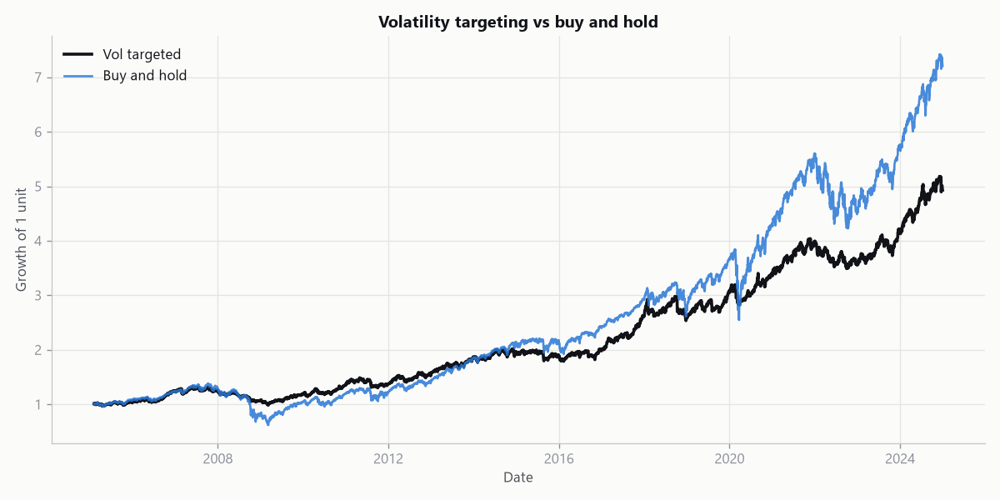
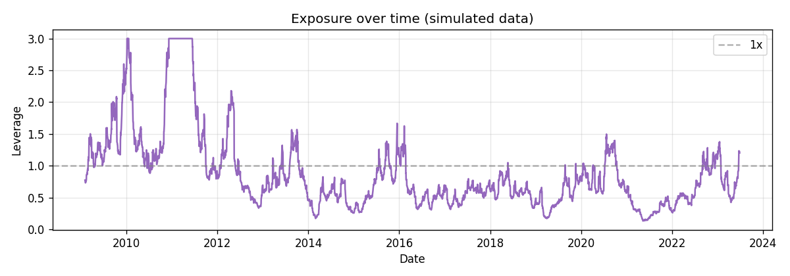
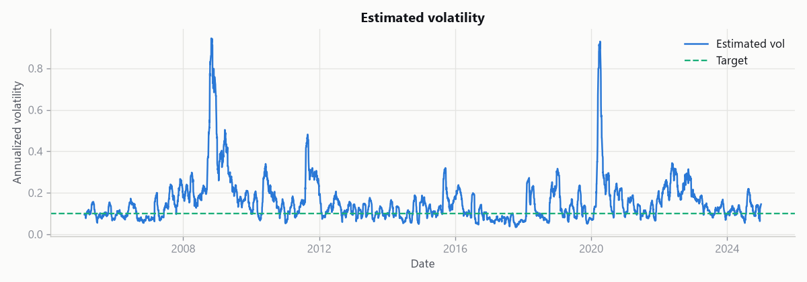

# Volatility Targeting

Most position-sizing is static: pick a weight, hold it, and let your risk swing
around with the market. Volatility targeting flips that. It sizes the position
so the portfolio aims for a constant level of risk. When the market is calm the
exposure rises, and when things get choppy the exposure shrinks, so realized
volatility stays near a chosen target instead of drifting wherever the market
takes it.

This repo builds that idea from scratch on a single liquid asset (SPY by
default) and measures honestly whether it does what it claims: keep risk steady
and, as a side effect, smooth out the worst of the drawdowns.

## The idea in one formula

For a target annual volatility `v` and an estimate of the asset's current
annual volatility `sigma`, the exposure is:

```
leverage = v / sigma
```

If you want 10% volatility and the market is currently running at 20%, you hold
half a unit. If it quietens to 8%, you hold 1.25 units. The exposure is capped
at `max_leverage` so a very calm stretch does not push the position to a silly
size.

The number that matters at the end is not the return, it is the realized
volatility. A volatility targeting strategy that lands near its target has done
its job. The script prints that comparison every run.

## Why this is worth building

Scaling exposure to a risk estimate is something every serious systematic shop
does in some form, and it is a concept that rewards understanding *why* it
works rather than just coding it up. Two effects show up again and again:

- **Risk stays where you put it.** Buy and hold lets your volatility wander. A
  targeted book holds it roughly constant, which makes position sizing across
  different assets comparable.
- **It tends to soften crashes.** Volatility usually spikes before and during
  large drawdowns, so the strategy is already cutting exposure as things get
  dangerous. That is not free money, and it can hurt in a sharp V-shaped
  recovery, but the drawdown profile is usually gentler.

## Example output

The charts below come straight from the plotting code in this repo. The
committed versions here were generated on simulated data, so they show what the
output looks like. Run `python scripts/run.py --save-plots` to reproduce them on
live market data.

The equity curve shows the targeted book riding through the volatile stretches
more smoothly than buy and hold:



The exposure rises when the market is calm and is cut back when volatility
spikes:



And the estimated volatility is what drives the sizing, shown against the target:



## How it works

| Module          | Responsibility                                              |
|-----------------|-------------------------------------------------------------|
| `data.py`       | Load one ticker's adjusted close behind a swappable loader  |
| `volatility.py` | Rolling and EWMA (RiskMetrics) volatility estimates         |
| `strategy.py`   | Turn the estimate into a capped position and run the backtest |
| `metrics.py`    | Daily-frequency CAGR, Sharpe, drawdown, realized volatility |
| `plotting.py`   | Equity curve, leverage, and rolling-volatility charts       |

Two estimators are included. The **rolling** estimator is the annualized
standard deviation of the last N days. The **EWMA** estimator weights recent
days more heavily using the RiskMetrics recursion, so it reacts faster to a
volatility spike. Switch between them with `--method`.

The backtest is lookahead-safe. The exposure decided at the close of one day is
applied to the *next* day's return, so a position is never sized using the
return it goes on to earn. There is a unit test that pins this down.

## Getting started

```bash
git clone https://github.com/KelsonLam/volatility-targeting.git
cd volatility-targeting
pip install -r requirements.txt
python scripts/run.py
```

The first run pulls prices from Yahoo Finance and caches them locally. To see
the charts:

```bash
python scripts/run.py --save-plots
```

Override settings without editing the config file:

```bash
# A higher risk target with the faster-reacting EWMA estimator
python scripts/run.py --target-vol 0.15 --method ewma
```

Run `python scripts/run.py --help` for the full list of options.

## Reading the output

Each run prints the targeted strategy next to a buy-and-hold of the same asset,
then a one-line volatility check, for example:

```
Target vol 10.00% | strategy realized 10.41% | buy-and-hold realized 19.83%
```

That line is the whole point. If the strategy's realized volatility sits near
the target while buy and hold is all over the place, the mechanism is working.

## Being honest about the assumptions

A risk model is only as good as the assumptions underneath it, so here is what
this one does and does not do.

- **Volatility is estimated, not known.** Both estimators look backward.
  Volatility can jump faster than any trailing window can react, so on the day
  of a shock the position is still sized off yesterday's calmer estimate. This
  is the single biggest limitation, and it is exactly when you most want the
  protection.
- **Leverage is assumed free and frictionless beyond the cost setting.** The
  transaction cost is a flat charge on the change in exposure. The model does
  not include borrowing cost for leverage above 1x, nor financing spreads.
- **No volatility-of-volatility modelling.** The target is constant. Some
  implementations also scale by the term structure of volatility or blend
  several lookbacks. This baseline keeps it to one estimator at a time.
- **One asset, one path.** The default runs on a single equity index over one
  historical sample. It is a clean demonstration of the mechanism, not a
  diversified production system, and one backtest is one realization of
  history rather than a forecast.

## Tests

```bash
pip install pytest
pytest
```

The suite runs on synthetic returns, so it is fast and offline. It checks both
estimators, the no-lookahead alignment, the leverage cap, that costs reduce
returns, and that the realized volatility actually lands near the target.

## Project layout

```
volatility-targeting/
├── config.yaml
├── requirements.txt
├── scripts/
│   └── run.py
├── src/vol_targeting/
│   ├── data.py
│   ├── volatility.py
│   ├── strategy.py
│   ├── metrics.py
│   └── plotting.py
└── tests/
    └── test_strategy.py
```

## License

MIT. See [LICENSE](LICENSE).
